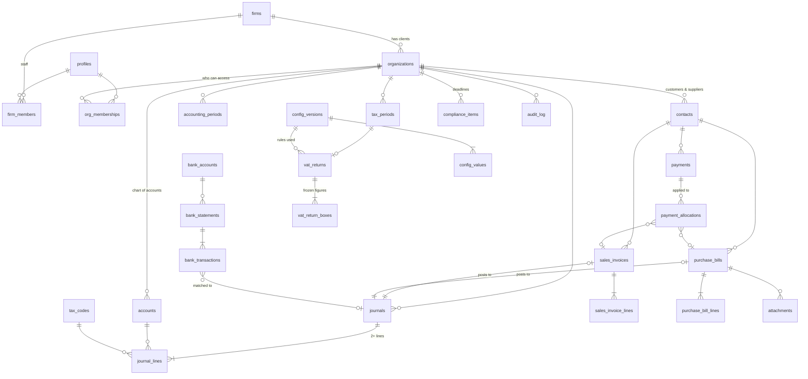

# Spec 01 — Data model (Supabase / PostgreSQL)

| | |
|---|---|
| **Status** | ✅ Approved by Faizan, 2026-10-06 |
| **Implements** | PLAN.md Phases 1–3 (Phase 4–5 tables marked *later*) |
| **Related** | [02 Roles & RBAC](02-roles-rbac.md) · [03 Configuration & formulas](03-configuration-and-formulas.md) · [04 Security](04-security.md) |

## In plain words

Today every number in the app is generated inside your browser from a demo script. We will
move it into a real database where each piece of information lives in exactly **one** place
and is linked to everything it belongs to — an invoice line belongs to an invoice, which
belongs to a customer, which belongs to a client company, which belongs to TFS Plus. The
database refuses anything that breaks those links or breaks accounting rules.

Reports (Trial Balance, P&L, VAT 201, ageing, dashboards) are **not stored** — they are
calculated from the posted journals every time, so they can never drift out of sync.

---

## 1. Inventory of static data in the POC → where it goes

Every hard-coded item found in `poc/src`, and its new home. Nothing is dropped silently.

| # | POC source | What it is today | New home | Notes |
|---|---|---|---|---|
| 1 | `seed.ts` `ORGS` | 3 demo clients | `organizations` | Demo rows only until production cut-over (PLAN P3-12) |
| 2 | `seed.ts` `CUSTOMERS`, supplier names in memos | Customers/suppliers as free text | `contacts` | Free-text party names become proper records with TRN |
| 3 | `seed.ts` journals, `JLine` | Generated ledger | `journals` + `journal_lines` | |
| 4 | `seed.ts` sales, `SalesInvoice`, `SaleLine` | Sales invoices | `sales_invoices` + `sales_invoice_lines` | Credit notes use the same tables (`doc_type`); `prices_include_vat` = prices entered incl. VAT (D-54, F-02) |
| 5 | `PurchaseDoc` (Capture page) | Purchase bills + checks | `purchase_bills` + `purchase_bill_lines` + `bill_checks` | Simulated OCR removed (D-01) |
| 6 | `BankLine` | Bank lines | `bank_statements` + `bank_transactions` | Uploaded CSV/Excel |
| 7 | `AuditEntry` | Audit trail (browser) | `audit_log` | Written by database triggers, append-only |
| 8 | `store.tsx` `USERS` (4 fake users + role switcher) | Demo identities | `auth.users` + `profiles` + `firm_members` + `org_memberships` | Real logins |
| 9 | `Org.autoApprove` | AI auto-approve thresholds | **Removed** (D-01) | Replaced by normal maker-checker |
| 10 | `coa.ts` `COA` | Chart of accounts (38 accounts) | `coa_templates` + `accounts` (per client) | Each client gets a copy it can extend |
| 11 | `coa.ts` `ctTag` on accounts | CT add-back tagging | `accounts.ct_tag` → `ct_tags` | Editable by Firm Admin |
| 12 | `coa.ts` `EMIRATES` | 7 emirates | `emirates` (reference table) | |
| 13 | `coa.ts` `TAX_CODES` | SR, ZR, EX, OS, RCS, BLK | `tax_codes` (reference + VAT box mapping) | Box mapping becomes data |
| 14 | `config.ts` `TAX_CONFIG` | Rates, thresholds, deadlines, legal refs | `config_versions` + `config_values` | Versioned, effective-dated (Spec 03) |
| 15 | `vat.ts` `EBOX`, `BOX_LABEL` | VAT 201 box codes & labels | `vat_boxes` + `tax_codes` mapping | Boxes 2, 6, 7 added (PLAN Phase 3) |
| 16 | `vat.ts` `quarters()` | Calendar quarters only | `organizations.vat_period_*` + `tax_periods` | Real FTA stagger (e.g. Feb/May/Aug/Nov) |
| 17 | `ct.ts` add-back rules (6140/6160/6170/6500) | Hard-coded account codes | `ct_tags` + `accounts.ct_tag` + config % | |
| 18 | `subledger.ts` `TERMS_DAYS = 30`, `BUCKETS` | Payment terms, ageing buckets | `contacts.payment_terms_days`, `firm_settings.ageing_buckets` | |
| 19 | `subledger.ts` FIFO allocation | Derived settlement | `payments` + `payment_allocations` | Explicit, auditable allocations; `payments.vat_advance / advance_emirate / advance_vat` and `payment_allocations.advance_vat` for advances with VAT on receipt (D-58, account 1170) |
| 20 | `derive.ts` `TODAY`, `MONTHS` | Fixed "today" = 1 Oct 2026 | Removed — real current date & selected period | |
| 21 | `derive.ts` `deadlines()` | Hard-coded deadlines list | `compliance_rules` (config) + `compliance_items` | Generated per client from rules |
| 22 | `ai.ts` `review()` checks | Art 59 checks, duplicate, risk score | Code (pure functions) + weights in `firm_settings` | Labelled "compliance checks", not AI |
| 23 | `ai.ts` `RULES`, `classify()`, `SAMPLES`, `ask()` | Keyword "AI", fake OCR, Q&A | **Removed** (D-01) | Replaced by "last account used for this supplier" default |
| 24 | `einvoice.ts` `VAT_CAT`, `validatePint()` rules | PINT AE mapping | `tax_codes.pint_category` + code | *Later* (Phase 4) |
| 25 | `pages/Sales.tsx` invoice no. `INV-XX-n`, fixed dates | Invoice numbering | `number_sequences` | Gap-free, per client, per document type |
| 26 | `pages/Bank.tsx` sample CSV | Demo text | Removed | |
| 27 | `pages/Capture.tsx` `SCAN_STEPS`, `PIPE` | Fake OCR pipeline | Removed | |
| 28 | `pages/Ask.tsx` | "Ask your books" | Removed (D-01) | |
| 29 | `pages/FirmOverview.tsx` staff names (`assignedTo`) | Free text | `organizations.manager_id` → `profiles` | |
| 30 | `Org.color` | Avatar colour | `organizations.brand_color` | Cosmetic |
| 31 | `i18n.ts` / `ar.ts` | Arabic strings | Stay in code; Arabic hidden until Phase 6 (D-05) | |
| 32 | `seq` counter in state | ID generator | Database UUIDs + `number_sequences` | |
| 33 | Session (`role`, `orgId`, `lang`) | Browser state | Supabase session + selected client in the URL | |

---

## 2. Design rules (apply to every table)

1. **Primary keys:** `id uuid default gen_random_uuid()`. Human numbers (invoice no., journal no.) are separate columns.
2. **Tenant key:** every business row carries `organization_id uuid not null` (FK) — even child rows like `journal_lines`, so security rules stay simple and fast.
3. **Money:** `bigint` in **fils** (1 AED = 100 fils). Never `numeric` floats, never `real`.
4. **Quantities & rates:** `numeric(18,4)` for quantity; rates in **basis points** `integer` (500 = 5%).
5. **Dates:** `date` for accounting dates; `timestamptz` for events (`created_at`, `posted_at`).
6. **Who/when on every row:** `created_at`, `created_by`, `updated_at`, `updated_by` (set by trigger, not the browser).
7. **Status as enums** (Postgres `enum` types) — no free-text statuses.
8. **Foreign keys everywhere**, with an index on every FK column; `on delete restrict` for accounting data (nothing financial is ever cascaded away).
9. **No hard deletes of financial data.** Draft documents may be deleted; anything posted is reversed, never deleted.
10. **Uniqueness enforced by the database:** e.g. one invoice number per client, one account code per client, one supplier bill number per supplier.

---

## 3. Entity relationship overview

---

## 4. Tables

`PK` primary key · `FK` foreign key · `U` unique · `NN` not null · `CK` check constraint.

### 4.1 Platform, people and access

**`platform_settings`** — platform-wide settings owned by TFS Plus (D-20): `app_name` (default "TFS+ Smart Ledger" — the name may change, so the UI and emails always read it from here), `logo_path`, `email_from` (`onboarding@resend.dev` in development, D-24), `email_reply_to`, `support_email`. Key/value rows, Super Admin only.

**`currencies`** — `code` (PK: `AED`, `USD`), `name`, `minor_units` (2). Only these two in v1 (D-21).

**`firms`** — tax firms using the platform. **TFS Plus** is the platform owner (`is_platform_owner = true`); other tax firms can be added later as customers (D-20). Firms are fully separated from each other.
| Column | Type | Rules |
|---|---|---|
| id | uuid | PK |
| legal_name | text | NN |
| is_platform_owner | boolean | exactly one firm can be `true` (partial unique index) |
| status | enum `active`/`suspended` | |
| trn | text | CK 15 digits starting with 1 |
| tax_agent_number | text | FTA tax agency number |
| emirate_code | text | FK → emirates |
| created_at / updated_at | timestamptz | |

**`profiles`** — one per login (`auth.users`). Created automatically when an invite is accepted.
| Column | Type | Rules |
|---|---|---|
| id | uuid | PK, FK → auth.users |
| full_name | text | NN |
| email | text | NN, U (copy of auth email) |
| is_super_admin | boolean | default false — only changeable by another super admin; **only allowed for members of the platform-owner firm** (trigger) |
| status | enum `active`/`suspended` | |
| last_sign_in_at | timestamptz | |

**`firm_members`** — firm staff and their firm-level role.
| Column | Type | Rules |
|---|---|---|
| firm_id | uuid | FK → firms |
| user_id | uuid | FK → profiles |
| role | enum `firm_admin`/`firm_accountant` | NN |
| active | boolean | |
| PK (firm_id, user_id) | | |

**`org_memberships`** — who may open which client, and as what.
| Column | Type | Rules |
|---|---|---|
| id | uuid | PK |
| organization_id | uuid | FK → organizations |
| user_id | uuid | FK → profiles |
| role | enum `firm_accountant`/`client_owner`/`client_staff`/`read_only` | NN |
| valid_from / valid_to | date | `read_only` must have `valid_to` (CK) |
| granted_by | uuid | FK → profiles |
| U (organization_id, user_id) | | |

Firm Admins see every client of their firm without a row here. Firm Accountants see only clients assigned here.

**`invitations`**
| Column | Type | Rules |
|---|---|---|
| id | uuid | PK |
| email | citext | NN |
| firm_id | uuid | FK |
| organization_id | uuid | FK, null for firm-level invites |
| role | text | must be a valid firm or org role (CK) |
| invited_by | uuid | FK → profiles |
| status | enum `pending`/`accepted`/`revoked`/`expired` | |
| expires_at | timestamptz | from setting `invite_expiry_days` |
| accepted_at | timestamptz | |

**`firm_support_grants`** *(built when the first outside firm joins)* — a firm's Firm Admin lets a named Super Admin see that firm's data for support: firm_id, granted_to (FK → profiles), granted_by, reason, valid_to (NN). Every use is audit-logged.

### 4.2 Reference data (shared by all clients, edited only by Super Admin)

| Table | Key columns | Purpose |
|---|---|---|
| **`emirates`** | code (PK: AUH, DXB, SHJ, AJM, UAQ, RAK, FUJ), name, vat_box (1a–1g) | Emirate list + its VAT 201 box |
| **`vat_boxes`** | code (PK: 1a…1g, 2, 3, 4, 5, 6, 7, 8, 9, 10, 11, 12, 13, 14), label, section (output/input/net), has_vat_column, sort | The VAT 201 form layout |
| **`tax_codes`** | code (PK: SR, ZR, EX, OS, RCS, BLK…), label, rate_key (→ config value), output_box, input_box, recoverable, pint_category | Which box each tax code lands in |
| **`ct_tags`** | code (PK: ENTERTAINMENT_50, FINES_PENALTIES, DONATION_NON_QPBE, NON_DEDUCTIBLE, CT_EXPENSE), label, addback_key (→ config value) | Corporate Tax adjustments |
| **`coa_templates`** + **`coa_template_accounts`** | code, name, type, subtype, ct_tag, is_control | Default UAE SME chart copied to new clients |

### 4.3 Clients

**`organizations`**
| Column | Type | Rules |
|---|---|---|
| id | uuid | PK |
| firm_id | uuid | FK → firms, NN |
| legal_name / trade_name | text | NN / optional |
| trn | text | CK format; U per firm |
| ct_trn | text | Corporate Tax registration number (can differ) |
| licence_no / licence_authority / licence_expiry | text/text/date | |
| emirate_code | text | FK → emirates (head office — default for invoices, D-10) |
| industry | text | |
| base_currency | char(3) | FK → currencies; always `AED` (books are in AED, D-21) |
| fy_start_month | smallint | 1–12 |
| vat_registered | boolean | |
| vat_period | enum `quarterly`/`monthly` | |
| vat_first_period_end | date | sets the FTA stagger (e.g. 2026-02-28 → Feb/May/Aug/Nov) |
| ct_regime | enum `standard`/`sbr`/`qfzp` | |
| prior_year_revenue | bigint (fils) | for SBR test |
| manager_id | uuid | FK → profiles (firm staff responsible) |
| status | enum `onboarding`/`active`/`archived` | |
| brand_color | text | cosmetic |

**`accounts`** — the client's chart of accounts.
| Column | Type | Rules |
|---|---|---|
| id | uuid | PK |
| organization_id | uuid | FK, NN |
| code | text | NN, U (organization_id, code) |
| name | text | NN |
| type | enum `asset`/`liability`/`equity`/`revenue`/`expense` | NN |
| subtype | text | e.g. bank, receivable, payable, vat_input, vat_output, customer_credits |
| ct_tag | text | FK → ct_tags |
| is_control | boolean | control accounts (AR, AP, VAT, bank) can't take manual lines |
| is_active | boolean | inactive accounts reject new postings |
| parent_id | uuid | FK → accounts (grouping) |

**`accounting_periods`** — monthly periods per client.
| Column | Type | Rules |
|---|---|---|
| id | uuid | PK |
| organization_id | uuid | FK |
| start_date / end_date | date | U (organization_id, start_date); no overlaps (exclusion constraint) |
| status | enum `open`/`locked` | |
| locked_by / locked_at / lock_reason | | set by `lock_period()` only |

**`tax_periods`** — VAT periods generated from the client's stagger.
| Column | Type | Rules |
|---|---|---|
| id | uuid | PK |
| organization_id | uuid | FK |
| kind | enum `vat`/`ct` | |
| start_date / end_date / due_date | date | due date from config (Spec 03 F-05/F-11) |
| U (organization_id, kind, start_date) | | |

### 4.4 Contacts

**`contacts`** — customers and suppliers.
| Column | Type | Rules |
|---|---|---|
| id | uuid | PK |
| organization_id | uuid | FK |
| kind | enum `customer`/`supplier`/`both` | |
| name | text | NN |
| trn | text | CK format when present |
| country_code | char(2) | NN, default AE |
| emirate_code | text | FK → emirates, optional |
| email / phone / address | text | |
| payment_terms_days | smallint | default from firm setting |
| default_account_id | uuid | FK → accounts ("last used" default for bills) |
| default_tax_code | text | FK → tax_codes |
| is_active | boolean | |
| U (organization_id, lower(name)) | | prevents duplicate contacts |

### 4.5 General ledger

**`journals`**
| Column | Type | Rules |
|---|---|---|
| id | uuid | PK |
| organization_id | uuid | FK |
| journal_no | text | from `number_sequences`; U per org |
| entry_date | date | NN; must fall in an **open** period to post |
| source | enum `manual`/`sale`/`purchase`/`receipt`/`payment`/`bank`/`opening`/`reversal`/`vat`/`ct` | |
| source_id | uuid | the document that produced it |
| memo | text | |
| contact_id | uuid | FK → contacts (AR/AP party) |
| status | enum `draft`/`pending`/`posted`/`reversed` | |
| reversal_of | uuid | FK → journals; U (one reversal per journal) |
| prepared_by / approved_by | uuid | FK → profiles; CK `approved_by <> prepared_by` |
| posted_at | timestamptz | |

**`journal_lines`**
| Column | Type | Rules |
|---|---|---|
| id | uuid | PK |
| journal_id | uuid | FK → journals |
| organization_id | uuid | FK; must equal the journal's (trigger) |
| line_no | smallint | U (journal_id, line_no) |
| account_id | uuid | FK → accounts; must belong to same org (trigger) |
| debit / credit | bigint | **AED fils**; CK ≥ 0; CK exactly one of them > 0 — reports always use these |
| currency | char(3) | FK → currencies; default AED |
| fx_rate | numeric(12,6) | 1 for AED; from `fx.usd_aed` for USD (D-21) |
| amount_fcy | bigint | original amount in document currency (cents); equals debit/credit for AED |
| tax_code | text | FK → tax_codes |
| vat_amount | bigint | CK ≥ 0 |
| supply_emirate | text | FK → emirates (D-10) |
| contact_id | uuid | FK → contacts |
| description | text | |

**Database guarantees (triggers + functions):**
- A journal can only become `posted` through `post_journal(id)`, which checks: ≥ 2 lines, Σ debit = Σ credit, all accounts active and in the same client, period open, approver ≠ preparer, approver has permission.
- Once `posted`, the journal and its lines cannot be updated or deleted (trigger raises an error). `reverse_journal(id, date, reason)` creates the mirror journal.

**`number_sequences`** — one gap-free **running counter** per client and document type (D-22); the year-month in the number is only a label from the document date.
| Column | Type | Rules |
|---|---|---|
| organization_id | uuid | FK |
| doc_type | enum `journal`/`sales_invoice`/`credit_note`/`receipt`/`payment` | prefixes JV / INV / CN / RCPT / PAY |
| next_value | bigint | taken with a row lock inside the posting transaction |
| PK (organization_id, doc_type) | | (never resets — Q-20) |

Number = format setting `numbering_format` (default `{PREFIX}-{YYYY}-{MM}-{SEQ:4}`, year-month from the document date), e.g. January ends `INV-2026-01-0100` → February starts `INV-2026-02-0101`. Numbers are assigned at posting, so deleted drafts never leave gaps. The counter grows beyond 4 digits automatically (`…-10000`).

### 4.6 Sales (receivables)

**`sales_invoices`**
| Column | Type | Rules |
|---|---|---|
| id | uuid | PK |
| organization_id | uuid | FK |
| doc_type | enum `invoice`/`credit_note` | |
| invoice_no | text | U per org (assigned at posting) |
| original_invoice_id | uuid | FK → sales_invoices; NN for credit notes |
| contact_id | uuid | FK → contacts (customer) |
| issue_date / due_date / supply_date | date | |
| supply_emirate | text | FK → emirates; pre-filled from org (D-10) |
| currency | char(3) | FK → currencies: AED or USD (D-21) |
| fx_rate | numeric(12,6) | fixed from `fx.usd_aed` (3.6725) for USD; 1 for AED; not editable per document |
| status | enum `draft`/`pending`/`posted`/`void` | |
| journal_id | uuid | FK → journals, U |
| net_total / vat_total / gross_total | bigint | AED fils, computed by function (line → AED → VAT), stored at posting |
| gross_total_fcy | bigint | total in document currency (for USD invoices) |
| einvoice_status | enum | *later* (Phase 4) |

**`sales_invoice_lines`**: id, sales_invoice_id (FK), organization_id, line_no, description, quantity numeric(18,4) CK > 0, unit_price bigint, account_id (FK revenue account), tax_code (FK), net bigint, vat bigint.

### 4.7 Purchases (payables)

**`purchase_bills`**: same shape as sales invoices plus `supplier_invoice_no` (U per org + contact), `supplier_trn_on_invoice`, `has_tax_invoice_heading`, `is_foreign_supplier`, `risk_level`, `risk_score`.

**`purchase_bill_lines`**: as sales lines (account = expense/asset).

**`bill_checks`**: id, purchase_bill_id (FK), check_code, passed boolean, severity enum, detail — results of the compliance checks (Art 59, duplicate, TRN format, VAT arithmetic).

**`attachments`**: id, organization_id, storage_path (private bucket `documents/{organization_id}/…`), file_name, mime_type, size_bytes, sha256 (U per org — blocks uploading the same file twice), linked purchase_bill_id / sales_invoice_id / bank_statement_id (CK exactly one), uploaded_by.

### 4.8 Payments, allocations and customer credits (D-11)

**`payments`**
| Column | Type | Rules |
|---|---|---|
| id | uuid | PK |
| organization_id | uuid | FK |
| kind | enum `customer_receipt`/`supplier_payment`/`customer_refund`/`supplier_refund` | receipts & supplier refunds → RCPT-, payments & customer refunds → PAY- |
| contact_id | uuid | FK |
| bank_account_id | uuid | FK → `accounts` (the GL bank/cash account; P2-05's `bank_accounts` map one-to-one to it) |
| payment_date | date | |
| amount_fcy / amount | bigint | settled with the contact (payment currency / AED); CK > 0 |
| bank_charges_fcy / bank_charges | bigint | D-34, posted to 6400 |
| writeoff_fcy / writeoff, fx_difference | bigint | D-34 small differences (6190), D-37 exchange differences (4310/6410) |
| credit_fcy / credit_aed | bigint | left as Customer Credit (2150) / Supplier advance (1160) at posting |
| currency / fx_rate / amount_fcy | | as on invoices (D-21) |
| is_advance_for_supply | boolean | *deferred to the VAT 201 work (D-35)* |
| status | enum `draft`/`pending`/`posted` | maker-checker like other documents |
| journal_id | uuid | FK → journals |

**`payment_allocations`**
| Column | Type | Rules |
|---|---|---|
| id | uuid | PK |
| organization_id | uuid | FK |
| payment_id | uuid | FK → payments |
| sales_invoice_id | uuid | FK, nullable |
| purchase_bill_id | uuid | FK, nullable |
| refund_id | uuid | FK → payments, nullable — the refund paying out this credit |
| amount_fcy / amount | bigint | CK > 0; AED on the document side |
| credit_amount | bigint | AED taken from a credit balance (later applications, refunds) |
| applied_on | date | |
| journal_id | uuid | FK — the credit-application journal (Dr 2150 / Cr 1100) when applied later |
| CK | | exactly one of sales_invoice_id / purchase_bill_id / refund_id |

Rules enforced by functions: allocations never exceed the payment amount or the document's open balance; the payment and the document must belong to the same contact. **Customer credit = payment amount − allocations** (no separate table, so it can't go out of sync).

### 4.9 Bank

| Table | Key columns | Rules |
|---|---|---|
| **`bank_accounts`** | id, organization_id, account_id (FK → GL bank account), name, bank_name, iban_last4, currency, column_mapping (D-38) | one GL account per bank account |
| **`bank_statements`** | id, organization_id, bank_account_id, file_name, file_sha256 (U per bank account — BANK-01), period_start, period_end, closing_balance, line/imported/duplicate counts, uploaded_by | the file itself is not stored |
| **`bank_transactions`** | id, organization_id, statement_id, txn_date, description, amount (signed fils), dedupe_hash (U per bank account), status enum `unmatched`/`matched`, journal_line_id (FK, U — one-to-one, BANK-02), matched_by | hash = date, amount, description, balance, n-th identical line in the file; lines are never edited or deleted |
| **`bank_reconciliations`** | id, organization_id, bank_account_id, period_end (U per account), statement_balance, book_balance, unreconciled_bank, unreconciled_book, snapshot, status pending/posted, prepared_by ≠ approved_by | CK book + bank items − book items = statement (BANK-03); approved = frozen (D-41) |

### 4.10 VAT returns

**`vat_returns`**: id, organization_id, tax_period_id (FK, U), status enum `draft`/`in_review`/`approved`/`filed`, prepared_by, approved_by (CK ≠ prepared_by), config_version_id (FK — which tax rules were used), snapshot jsonb (the full return), snapshot_sha256, approved_at, filed_at, fta_reference.

**`vat_return_boxes`**: vat_return_id (FK), box_code (FK → vat_boxes), amount bigint, vat bigint, adjustment bigint — **every box is always written, 0 when empty (D-12)**. PK (vat_return_id, box_code).

Approving a return freezes it (no update/delete trigger) and locks the accounting periods it covers.

### 4.11 Configuration (details in Spec 03)

| Table | Purpose |
|---|---|
| **`config_versions`** | id, label (e.g. `uae-2026.10`), effective_from, effective_to, status `draft`/`approved`, created_by, approved_by, approved_at |
| **`config_values`** | version_id (FK), key (e.g. `vat.rate_bp`), value jsonb, legal_reference, last_verified, needs_verification boolean. PK (version_id, key) |
| **`firm_settings`** | firm_id, key, value jsonb, updated_by, updated_at — operational settings (email, invites, ageing buckets, reminders) |
| **`email_templates`** | key (invite, deadline_reminder, approval_waiting, integrity_alert), subject, body, variables, updated_by |
| **`compliance_rules`** | key, kind (vat/ct/licence/einvoicing), offset rule, applies_when — generates deadlines |

### 4.12 Operations

| Table | Purpose |
|---|---|
| **`compliance_items`** | id, organization_id, rule_key, title, due_date, status `open`/`done`/`waived`, completed_by, completed_at |
| **`notifications`** | id, user_id, organization_id, kind, title, body, read_at |
| **`email_log`** | id, to_email, template_key, provider_message_id, status, error, related entity, sent_at |
| **`integrity_runs`** + **`integrity_results`** | nightly checks: TB balances, AR/AP = control, VAT return = VAT accounts, bank reconciled |
| **`audit_log`** | id bigint identity, occurred_at, actor_id, actor_role, organization_id, action, table_name, row_id, before jsonb, after jsonb, request_id — append-only (no update/delete for anyone) |

### 4.13 Later phases (designed now, built later)

| Phase | Tables |
|---|---|
| 4 — E-invoicing | `einvoice_transmissions` (invoice_id, asp, status, xml_path, receipts, idempotency_key U), `asp_connections` |
| 5 — CT & year-end | `ct_computations` (+ snapshot), `ct_manual_adjustments`, `tax_losses` (year, amount, utilised), `fixed_assets`, `depreciation_runs`, `year_end_closes` |

---

## 5. Calculated, not stored (SQL views / functions)

| Output | Built from | Notes |
|---|---|---|
| Trial balance (any date range) | posted `journal_lines` | function `trial_balance(org, from, to)` |
| P&L, Balance Sheet | trial balance + account types | |
| General ledger / account statement | posted lines | |
| AR / AP open items & ageing | invoices/bills − allocations | buckets from settings |
| Customer credit balances | receipts − allocations | |
| VAT 201 (draft) | posted lines + `tax_codes` + `vat_boxes` + config | frozen into `vat_return_boxes` on approval |
| Dashboards, firm overview | the functions above | |
| Bank reconciliation | bank_transactions vs GL bank account | |

---

## 6. Acceptance tests for this spec

| ID | Check | Expected |
|---|---|---|
| DM-01 | Insert a journal line whose account belongs to another client | Rejected |
| DM-02 | Two invoices with the same number in one client | Rejected (unique) |
| DM-03 | Same invoice number in two different clients | Allowed |
| DM-04 | Delete a contact that has posted invoices | Rejected (FK restrict) |
| DM-05 | Payment allocation larger than the invoice's open balance | Rejected |
| DM-06 | Allocation pointing at both an invoice and a bill | Rejected (check) |
| DM-07 | Bank transaction uploaded twice | Second one rejected (dedupe hash) |
| DM-08 | Same PDF attached twice to one client | Rejected (sha256 unique) |
| DM-09 | Every FK column has an index | Supabase performance advisor: 0 "unindexed foreign key" findings |
| DM-10 | Every table in `public` has RLS enabled | Security advisor: 0 findings |
| DM-11 | Approved VAT return has a row for **every** box | 100% of `vat_boxes` present, empty = 0 |
| DM-12 | Read-only membership without an end date | Rejected (check) |
| DM-13 | Set `is_super_admin` on a user from a non-owner firm | Rejected (trigger) |
| DM-14 | Second firm marked as platform owner | Rejected (unique) |
| DM-15 | Invoice in EUR | Rejected (FK → currencies) |
